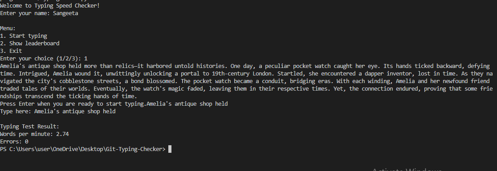
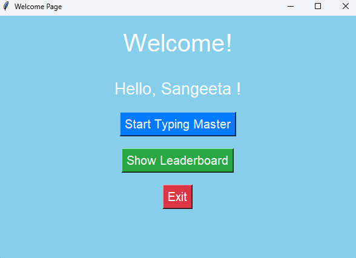

# Terminal Typing Master

The Terminal Typing Master is a simple Python program designed to help users improve their typing speed and accuracy directly from the terminal. With this application, users can practice typing random words and sentences, measure their typing speed, and track their progress over time.

## Features

- **Typing Practice**: Users can practice typing random words and sentences provided by the program.
- **Typing Speed Measurement**: The program calculates the user's typing speed in words per minute (WPM) and accuracy.
- **Progress Tracking**: Users can track their typing speed and accuracy over multiple practice sessions.
- **Customizable Settings**: The program allows users to customize settings such as the duration of typing sessions and the difficulty level of the words/sentences.
- **User-Friendly Interface**: The interface is simple and intuitive, making it easy for users to focus on their typing practice.

## Installation

To run the Terminal Typing Master, follow these steps:

1. Clone the repository to your local machine:

    ```
        git clone https://github.com/your_username/terminal-typing-master.git
    ```
2.Navigate to the project directory:
    ```
        cd GIT-TYPING-CHECKER
    ```
3.Run the program:
    ```
        python TypingMaster.py
    ```
Usage
Launch the program by running typing_master.py.
Follow the on-screen instructions to start a typing practice session.
Type the words or sentences displayed on the screen as accurately and quickly as possible.
Once the typing session is complete, the program will display your typing speed (WPM) and accuracy.




Contributing
Contributions are welcome! If you would like to contribute to the Terminal Typing Master, please follow these guidelines:

Fork the repository.
Create a new branch for your feature or bug fix.
Make your changes and ensure the code passes any existing tests.
Test the program thoroughly.
Submit a pull request with a clear description of your changes.


Contact
If you have any questions, suggestions, or issues regarding the Terminal Typing Master, feel free to contact us at sangeeta136428sharma@gmail.com. We appreciate your feedback!


